# 📈 Machine Learning Equity Alpha Signal Model


**Final Model:** Ensemble + LSTM Hybrid  
**Forecast Horizon:** 20-day forward return  
**Final Mean IC:** 0.1284  
**Net Sharpe:** 0.6369  
**Net Return:** 25.91%

An end-to-end quantitative research project that builds, validates, and evaluates an equity alpha signal using machine learning, LSTM walk-forward validation, and transaction-cost-aware portfolio backtesting.

## 1. Project Overview

This project develops a machine learning equity alpha framework designed to predict future 20-day stock returns and translate those predictions into a long-short portfolio strategy.

I built the project as a portfolio-level quantitative research workflow rather than a simple prediction exercise. The pipeline includes historical price data collection, feature engineering, baseline machine learning models, LSTM sequence modeling, out-of-sample validation, signal blending, transaction-cost analysis, turnover diagnostics, and final model selection.

The final selected signal was:

**`pred_final_ens_lstm` — Ensemble + LSTM Hybrid Signal**

This model was selected because it provided the strongest clean balance between signal quality, risk-adjusted return, drawdown control, and implementation feasibility.

## 2. Final Model Results

| Metric | Final Model Result |
|---|---:|
| Final Signal | `pred_final_ens_lstm` |
| Mean Information Coefficient | 0.1284 |
| ICIR | 0.4068 |
| Net Sharpe Ratio | 0.6369 |
| Net Return | 25.91% |
| Max Drawdown | -15.42% |
| Turnover | 106.82% |
| Hit Rate | 54.55% |
| Calmar Ratio | 0.9457 |

## 3. Methodology

The project followed a complete alpha research workflow:

1. Collected historical stock and benchmark price data.
2. Built engineered features such as momentum, volatility, beta, moving-average signals, RSI, Bollinger Band position, and QQQ market-regime indicators.
3. Trained baseline machine learning models, including Random Forest, Gradient Boosting, and an ensemble model.
4. Evaluated model quality using RMSE, directional accuracy, and prediction/actual correlation.
5. Built a corrected non-overlapping 20-day backtest aligned with the prediction horizon.
6. Added Information Coefficient, ICIR, transaction costs, turnover, drawdown, and Calmar ratio.
7. Extended the model with LSTM walk-forward validation.
8. Blended LSTM predictions with ensemble model outputs.
9. Diagnosed IC versus Sharpe tradeoffs.
10. Tested sector-neutral signals as robustness diagnostics.
11. Selected the final clean model after excluding sector-neutral variants from the final decision.

## 4. Key Visual Results

### Backtesting Dashboard

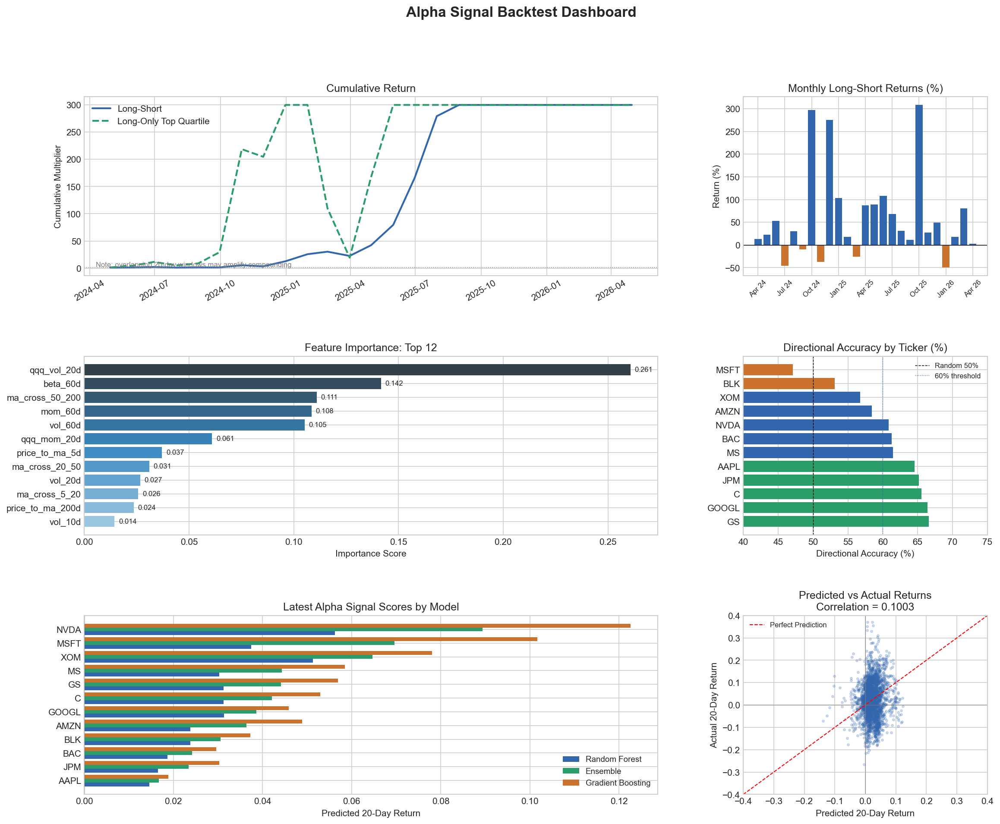

### Transaction Costs, Turnover, and Signal Quality

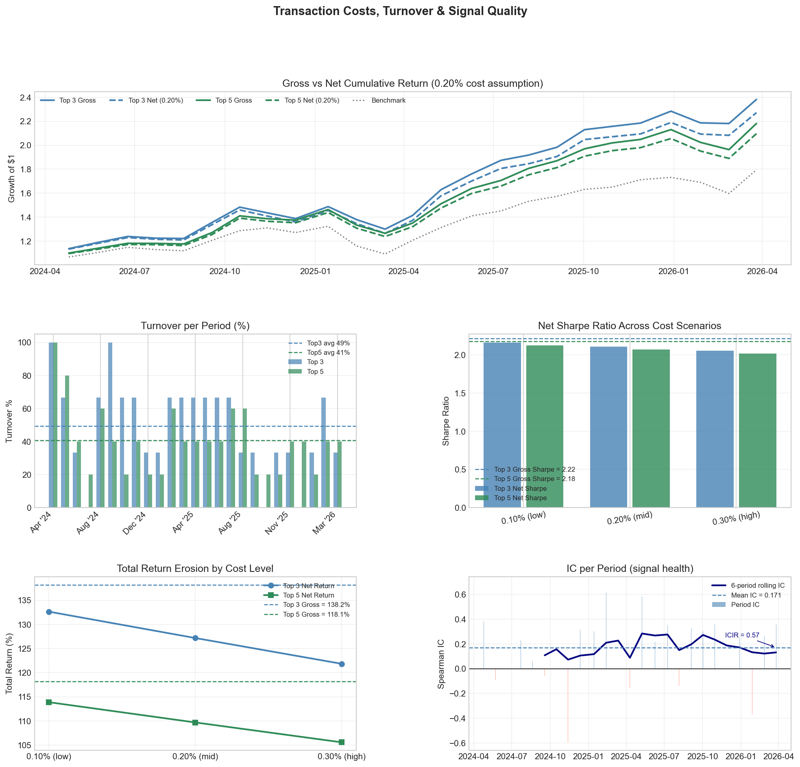

### LSTM Out-of-Sample Signal Quality

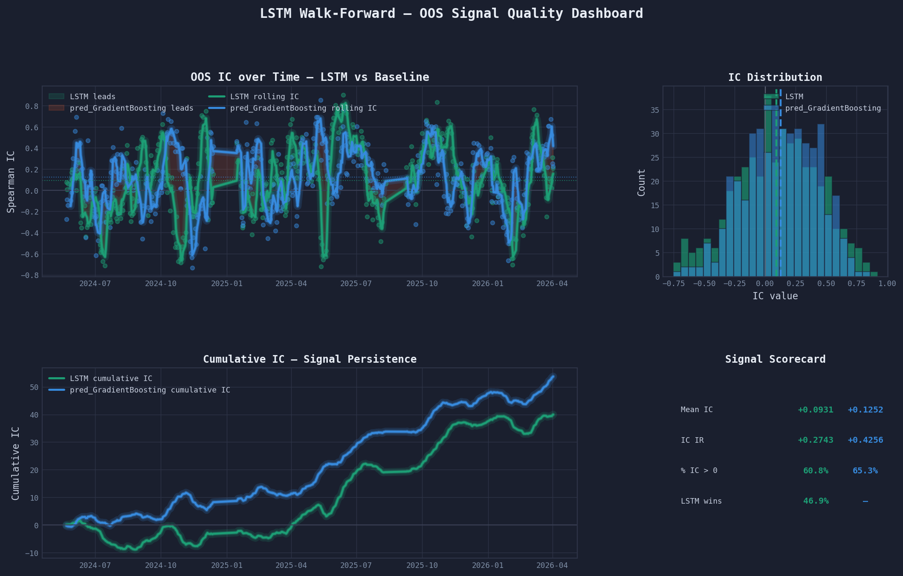

### Final Model Comparison: Net Sharpe

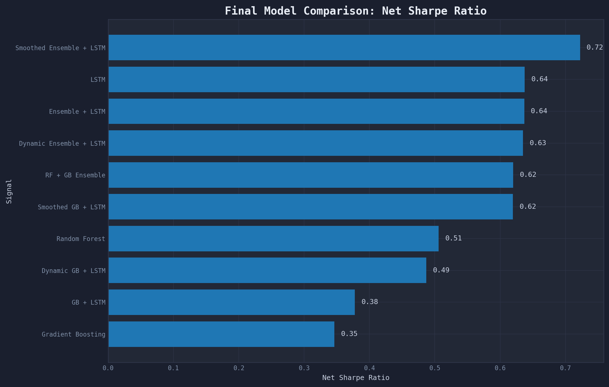

### Risk-Return Tradeoff

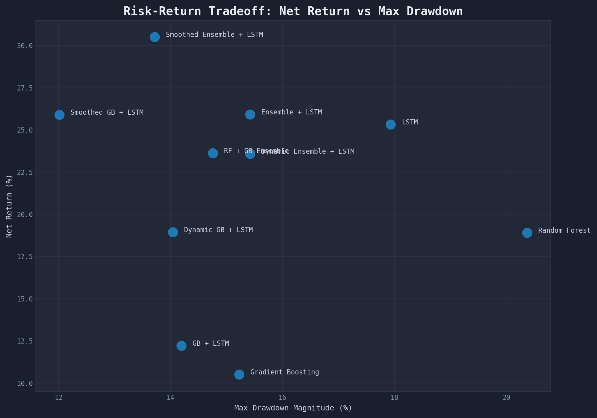

### Final Model Dashboard

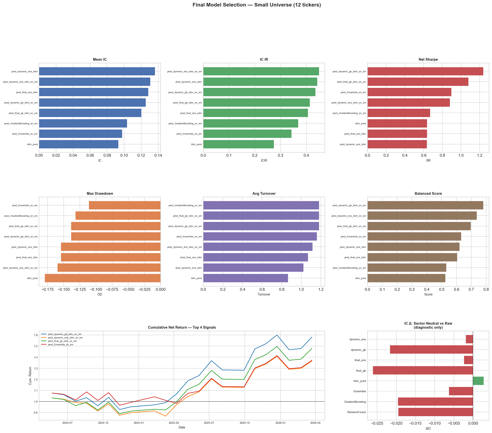

### Feature Importance

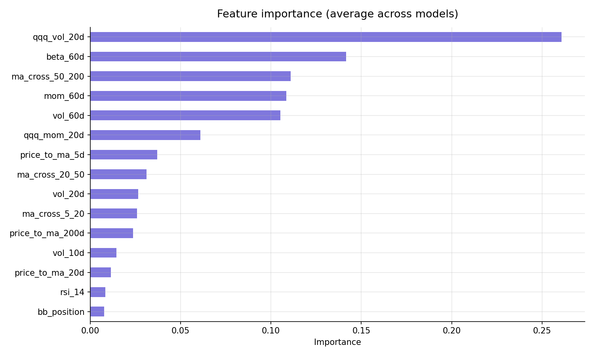

### Baseline Model Metrics

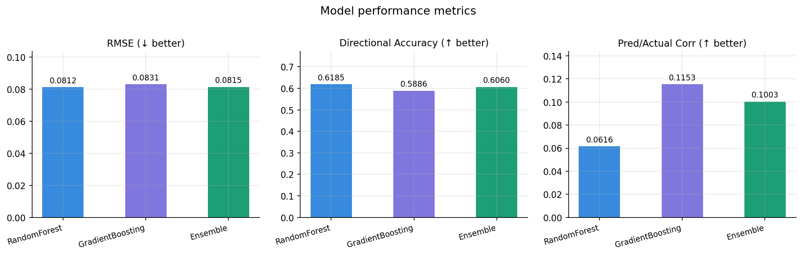

### Portfolio Sensitivity Heatmaps

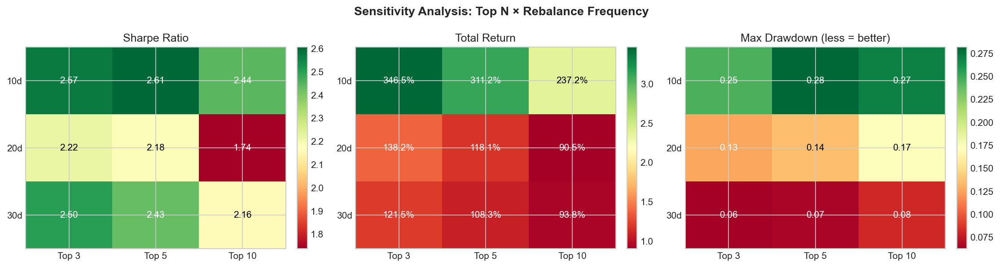

### Top 3 vs Top 5 Portfolio Comparison

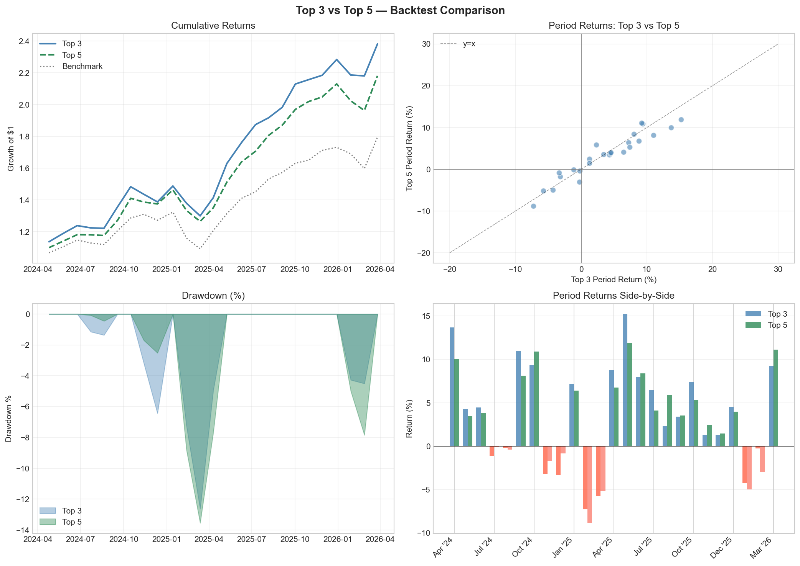

### Entry Threshold Sensitivity

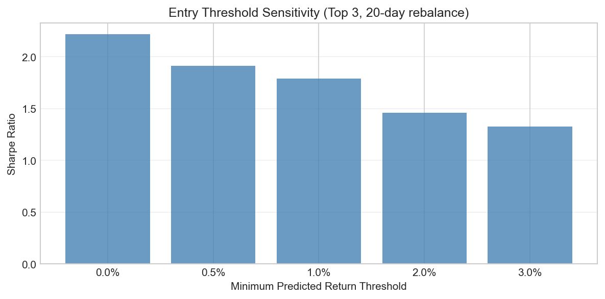

### Latest Alpha Rankings

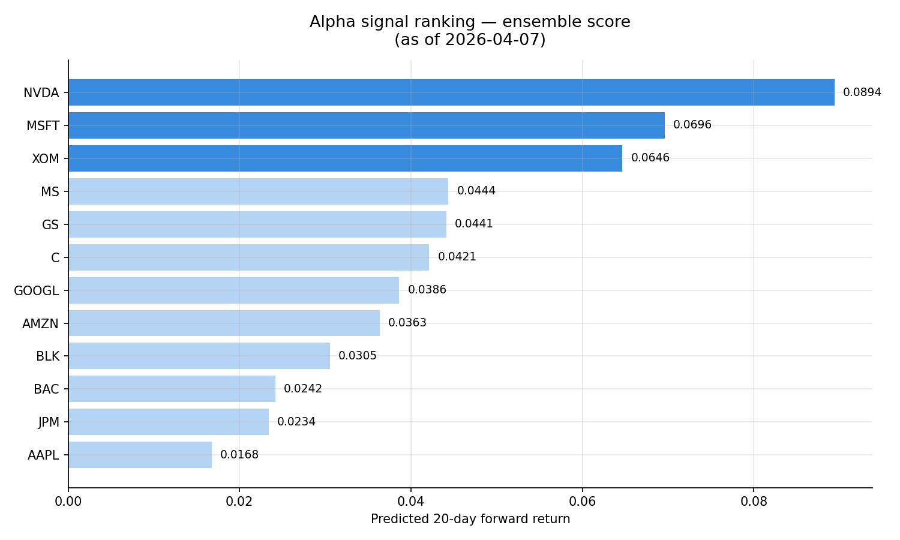

## 5. Key Findings

The project produced several important findings:

- The final Ensemble + LSTM hybrid signal delivered the strongest clean balance across IC, Sharpe ratio, drawdown, turnover, and Calmar ratio.
- LSTM added value as a temporal modeling layer, but it was most useful when blended with the ensemble model rather than used alone.
- The highest Mean IC signal was not always the best portfolio signal, because high turnover and drawdown could weaken net Sharpe.
- Transaction-cost analysis was essential because trading friction materially affected portfolio performance.
- Sector-neutral testing was informative, but it was treated as a diagnostic rather than a final selection method because the stock universe was small and uneven across sectors.
- The model behaved partly like a market-regime detector, with volatility and benchmark-regime features playing an important role.
- The Fold 2 audit showed that weak performance in one validation window was a genuine regime-specific model limitation, not simply a missing-data problem.

## 6. Repository Structure

```text
equity-alpha-signal-ml/
│
├── README.md
├── requirements.txt
├── .gitignore
│
├── notebooks/
│   ├── 01_data_collection_and_preparation.ipynb
│   └── 02_backtesting_lstm_and_final_model_selection.ipynb
│
├── charts/
│   ├── backtest_dashboard.png
│   ├── costs_turnover_ic_dashboard.png
│   ├── chart3_ic_dashboard.png
│   ├── clean_chart_1_net_sharpe.png
│   ├── clean_chart_4_risk_return.png
│   └── final_model_dashboard.png
│
├── outputs/
│   ├── features_and_targets.csv
│   ├── test_predictions.csv
│   ├── lstm_oos_predictions.csv
│   ├── train_with_regime_features.csv
│   ├── final_signal_comparison.csv
│   ├── final_model_selection.csv
│   ├── clean_final_model_selection_no_sector_neutral.csv
│   ├── final_selected_model_scorecard.csv
│   └── lstm_fold_metrics.csv
│
└── docs/
```

## 7. Tools and Libraries

The project used:

- Python
- pandas
- NumPy
- scikit-learn
- PyTorch
- SciPy
- Matplotlib
- yfinance
- Jupyter Notebook

## 8. How to Run

Clone the repository:

```bash
git clone https://github.com/YOUR-USERNAME/equity-alpha-signal-ml.git
cd equity-alpha-signal-ml
```

Install the required libraries:

```bash
pip install -r requirements.txt
```

Open the notebooks in Jupyter Notebook or JupyterLab:

```bash
jupyter notebook
```

Run the notebooks in this order:

```text
1. notebooks/01_data_collection_and_preparation.ipynb
2. notebooks/02_backtesting_lstm_and_final_model_selection.ipynb
```

### Important File Path Note

The notebooks use CSV files saved in the `outputs/` folder. If a notebook cell uses a file path such as:

```python
pd.read_csv("features_and_targets.csv")
```

and the notebook is inside the `notebooks/` folder, update the path to:

```python
pd.read_csv("../outputs/features_and_targets.csv")
```

Similarly, output files can be saved to:

```python
"../outputs/file_name.csv"
```

and chart files can be saved to:

```python
"../charts/chart_name.png"
```

## 9. Main Output Files

The most important output files are:

| File | Description |
|---|---|
| `final_signal_comparison.csv` | Final comparison across candidate signals |
| `final_model_selection.csv` | Model-selection table before clean exclusion |
| `clean_final_model_selection_no_sector_neutral.csv` | Final clean model selection excluding sector-neutral variants |
| `final_selected_model_scorecard.csv` | Final selected model scorecard |
| `lstm_fold_metrics.csv` | LSTM walk-forward validation metrics |
| `lstm_oos_predictions.csv` | Out-of-sample LSTM predictions |
| `true_oos_lstm_ic_by_date.csv` | True OOS LSTM IC by date |

## 10. Limitations

This project was designed as a research and portfolio project, not as a live trading system. Several limitations remain:

- The universe contained only 12 tickers, which limited the reliability of sector-neutral testing.
- Transaction costs were modeled using simplified assumptions.
- Portfolio construction used equal-weight long-short logic rather than formal optimization.
- The LSTM signal showed regime-dependent performance.
- The project did not include a full factor risk model.
- Sector and beta neutralization would be more rigorous in a broader universe.
- The model should be tested on additional market regimes before any live trading use.

## 11. Future Work

Future improvements could include:

- Expanding the stock universe to 50+ securities.
- Adding factor-risk controls and beta neutralization.
- Testing sector-neutral and industry-neutral portfolio construction on a broader universe.
- Adding signal-proportional position sizing.
- Applying turnover constraints and portfolio optimization.
- Running additional stress tests across difficult market environments.
- Building an interactive GitHub Pages dashboard.

## Interactive Project Page

An interactive project webpage is available through GitHub Pages. The page summarizes the methodology, final model results, and key visualizations from the equity alpha signal framework.

## 12. Disclaimer

This project is for educational and portfolio purposes only. It is not financial advice, investment advice, or a recommendation to buy or sell securities.

## AI-Assisted Tools Disclosure

AI-assisted tools, including ChatGPT by OpenAI and Claude by Anthropic, were used for code debugging, markdown drafting, explanation refinement, and project-structure support. All final interpretations, modeling decisions, and conclusions were reviewed and finalized by the author.
